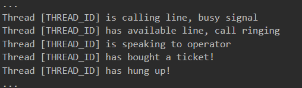

# Call Center Simulation

A simulation C program that creates a set amount of threads representing incoming calls to a call center offering up free talk show tickets. Uses semaphores to manage the threads access to resources such as functions representing call operators and variables representing available tickets.

